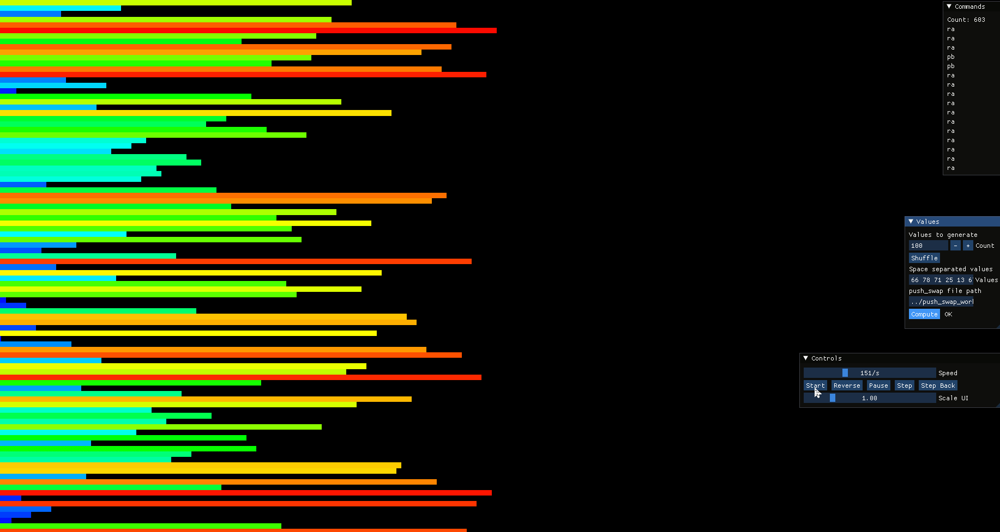

# push_swap

`push_swap` is an algorithms project written in C. Given a list of unique integers, the program prints the shortest instruction sequence it can find to sort them using only two stacks and a small fixed set of moves.

This was a solo school project completed in about one month, in April 2023. Final grade: `125/100`, including all bonus requirements.



## The Problem

Instead of sorting an array directly, the program starts with every number in stack `a` and an empty stack `b`. It may only use these operations:

| Operation | Meaning |
| --- | --- |
| `sa`, `sb`, `ss` | swap the top values of one or both stacks |
| `pa`, `pb` | push the top value from one stack to the other |
| `ra`, `rb`, `rr` | rotate one or both stacks upward |
| `rra`, `rrb`, `rrr` | rotate one or both stacks downward |

The output is not the sorted list. The output is the move list that another program can replay to perform the sort.

Example:

```sh
cd push_swap_working
make
./push_swap 3 2 1
```

Possible output:

```text
sa
rra
```

## Why This Is Challenging

The hard part is not simply making the stack sorted. It is making the move count low enough to pass strict grading thresholds, while also handling every invalid input case cleanly.

The project combines several constraints that are easy to underestimate:

- The algorithm is limited to a tiny instruction language, so common sorting approaches cannot be used directly.
- Every integer must be parsed safely, including quoted input, signs, duplicates, and values outside the `int` range.
- The program is written in C, so memory allocation and linked-list cleanup have to be correct on both success and error paths.
- Small inputs need special-case optimal handling, while large inputs need a scalable heuristic.
- The bonus checker must read arbitrary instructions from standard input, validate them, replay them, and report whether the final stacks are sorted.

## Implementation Overview

The main solution lives in `push_swap_working/`.

For tiny lists, the code uses direct decision logic for two, three, four, and five numbers. For larger lists, it uses a two-phase strategy:

1. **Rough pass:** split values into chunks and push groups from stack `a` to stack `b`.
2. **Fine pass:** bring values back from `b` to `a` by choosing high-value candidates with favorable rotation costs.

After generating the instruction list, the program does a small optimization pass that replaces compatible neighboring operations with combined operations, such as:

```text
ra + rb  -> rr
rra + rrb -> rrr
sa + sb -> ss
```

This keeps the output correct while reducing the final move count.

## Bonus Work

The bonus executable is `checker`.

```sh
cd push_swap_working
make bonus
ARG="4 1 3 2"
./push_swap $ARG | ./checker $ARG
```

`checker` prints:

- `OK` if the supplied operations sort the stack.
- `KO` if the operations run but do not sort it.
- `Error` if the input or instruction stream is invalid.

## Repository Layout

```text
push_swap_working/     C implementation, Makefile, custom libft, bonus checker
push_swap_testing/     Python and shell scripts used for randomized testing
push_swap_visualizer/  C++/SFML visualizer for watching the stack operations
en.subject.pdf         Original project specification
```

## Build Commands

```sh
cd push_swap_working
make        # builds push_swap
make bonus  # builds checker
make clean
make fclean
```

The project builds with `cc` using `-Wall -Wextra -Werror` and a local `libft` support library.

## Testing Notes

The repository includes scripts for generating random inputs, replaying results through a checker, and collecting move-count statistics. There is also a visualizer project that can animate the generated operations, which is useful for debugging a sorting algorithm that otherwise only prints text commands.

These extra tools are not required to run `push_swap`, but they were important for tuning the algorithm and completing the bonus portion.
